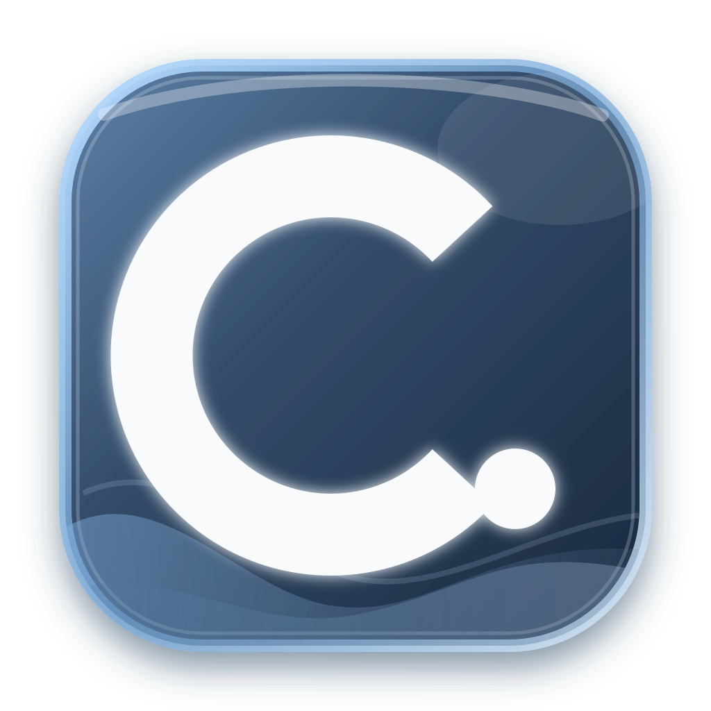

# C.le. Clip

### 让复制，不止于粘贴。

**面向 Windows 与 macOS 的本地优先智能剪贴板工作区。**  
记录你复制过的内容，并通过 **C.le. Actions** 与 **Prompt Lab**，把「复制 → 查找 → 处理 → 再使用」连接成一个更自然的桌面工作流。

**[下载 / Releases](https://github.com/Cle0726/C.le.Clip/releases)** · **[问题反馈 / Issues](https://github.com/Cle0726/C.le.Clip/issues)**

---

## 💡 C.le. Clip 是什么？

系统剪贴板解决的是「复制和粘贴」。

**C.le. Clip 想解决的是复制之后发生的事情。**

找回几分钟前复制的文字、重新使用一张图片、收藏经常粘贴的内容、快速搜索历史记录，或者把一段普通文本继续整理成更清晰的 Prompt —— 这些操作不应该需要在多个应用之间反复切换。

---

## ✨ 核心特性

* ⚡ **毫秒级离线检索**：文本、富文本与图像历史毫秒级极速响应，支持快捷键呼出与快速筛选。
* 🛠️ **C.le. Actions 原生动作**：复制后即可在上下文直接进行文本清洗、代码格式化、多语言转换等即时流水线处理。
* 🧪 **Prompt Lab（提示词实验室）**：将碎片化剪贴内容与上下文在本地一键提炼打磨为结构化 AI Prompt，大幅缩短生成式 AI 交互链路。
* 🔒 **Local-first 隐私安全**：所有剪贴历史数据仅保存在本地设备，不上传任何第三方云端。
