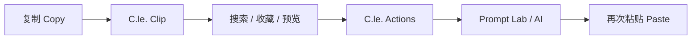

<div align="center">


# C.le. Clip

### 让复制，不止于粘贴。

**面向 Windows 与 macOS 的本地优先智能剪贴板工作区。**  
记录你复制过的内容，并通过 **C.le. Actions** 与 **Prompt Lab**，把「复制 → 查找 → 处理 → 再使用」连接成一个更自然的桌面工作流。

[](https://github.com/Cle0726/C.le.Clip/releases)
[](https://github.com/Cle0726/C.le.Clip/releases)
[](https://github.com/Cle0726/C.le.Clip/actions/workflows/ci.yml)
[](https://tauri.app/)

**[下载 / Releases](https://github.com/Cle0726/C.le.Clip/releases)** · **[问题反馈 / Issues](https://github.com/Cle0726/C.le.Clip/issues)**

</div>

---

## C.le. Clip 是什么？

系统剪贴板解决的是「复制和粘贴」。

**C.le. Clip 想解决的是复制之后发生的事情。**

找回几分钟前复制的文字、重新使用一张图片、收藏经常粘贴的内容、快速搜索历史记录，或者把一段普通文本继续整理成更清晰的 Prompt —— 这些操作不应该需要在多个应用之间反复切换。

C.le. Clip 希望成为操作系统与各种应用之间的一层轻量工作区：需要时快速出现，完成操作后安静隐藏。

> **Clipboard → Actions → AI**
>
> 剪贴板负责捕获内容，C.le. Actions 负责继续处理，AI 只在你主动需要时参与。

## 核心能力

| 能力 | 说明 |
| --- | --- |
| **Clipboard History** | 自动记录文本与图片剪贴板历史，本地持久化、去重、搜索、收藏、删除与重新复制。 |
| **C.le. Actions** | 让历史内容不仅能“再复制一次”，还可以成为后续整理、处理与自动化操作的入口。 |
| **Prompt Lab** | 提供智能、简洁、详细、编程、写作、图像、分析等优化模式；基础模板可完全离线使用。 |
| **Local First** | 剪贴板历史默认保存在本地。联网 AI 为可选能力，不会因为程序常驻就自动上传你的剪贴板内容。 |

### 剪贴板历史

- 自动捕获文本与图片内容
- SQLite 本地持久化与去重
- 快速搜索历史记录
- 收藏常用内容
- 删除单条记录或清理未收藏历史
- 一键重新复制到系统剪贴板
- 默认保留 200 条未收藏记录，避免历史无限增长

### 快速桌面体验

- Windows：`Ctrl + Shift + V`
- macOS：`⌘ + Shift + V`
- 系统托盘常驻
- `Esc` 或关闭窗口时快速隐藏
- 可选开机启动
- 面向键盘与高频操作优化

### Prompt Lab

Prompt Lab 不是独立于剪贴板之外的另一个工具，而是复制工作流的下一步。

你可以从已经复制的文本出发，继续进行智能优化、精简、扩写、编程优化、写作优化、图像提示词整理或分析结构化。默认本地模板无需联网即可工作；如果需要更强的生成能力，也可以选择配置 OpenAI-compatible AI Provider。

## 工作流



C.le. Clip 的目标不是把剪贴板变成一个越来越复杂的数据库，而是缩短从「我刚刚复制了什么」到「我下一步要拿它做什么」之间的距离。

## 本地优先与隐私

剪贴板里可能出现聊天内容、代码、链接、工作资料，甚至其他敏感信息，因此 C.le. Clip 从设计上采用 **Local First，本地优先** 的方式。

剪贴板历史默认保存在当前设备的本地数据库中，可以随时删除。Prompt Lab 的本地模板不会访问网络；只有当你主动切换到 AI 优化并执行生成时，当前选择的文本才会发送到你所配置的 AI Endpoint。

AI Endpoint 与模型配置保存在本地；API Key 不写入 SQLite，也不会提交到 Git，而是通过系统凭据能力保存：Windows 使用系统凭据管理能力，macOS 使用 Keychain。

后续版本还会继续完善按应用排除、暂停记录和更细粒度的隐私规则。

## 下载

发布版本通过 **GitHub Releases** 提供：

| 平台 | 目标架构 | 安装包 |
| --- | --- | --- |
| Windows | x64 | `.exe` / `.msi` |
| macOS | Apple Silicon | `.dmg` |
| macOS | Intel | `.dmg` |

前往：**[C.le. Clip Releases](https://github.com/Cle0726/C.le.Clip/releases)**

> 当前发布包尚未完成代码签名 / notarization 时，Windows SmartScreen 或 macOS Gatekeeper 可能显示安全提示。正式签名将作为后续发布流程的一部分完善。

## 技术架构

C.le. Clip 使用一套偏轻量的跨平台桌面架构：

- **Tauri 2** — 桌面应用壳层与系统集成
- **Rust** — 剪贴板、数据库、系统能力与核心逻辑
- **React 19 + TypeScript + Vite** — 用户界面
- **SQLite / rusqlite** — 本地剪贴板历史
- **arboard** — 跨平台剪贴板读写
- **keyring** — Windows Credential Manager / macOS Keychain

相比单纯使用 Web 容器封装桌面应用，Tauri 让 C.le. Clip 可以保持较小的体积与资源占用，同时获得更直接的系统能力。

## 本地开发

需要：

- Node.js 22
- Rust stable
- 对应平台的 Tauri 2 系统依赖

启动桌面开发环境：

```bash
npm install
npm run tauri:dev
```

仅启动前端：

```bash
npm run dev
```

构建桌面安装包：

```bash
npm run tauri:build
```

应用图标会在开发 / 构建过程中由 Tauri 根据 `src-tauri/icons/icon-source.svg` 自动生成对应平台所需尺寸与格式。

## 路线图

- [x] 文本剪贴板历史
- [x] 图片剪贴板历史与预览
- [x] SQLite 持久化与去重
- [x] 搜索、收藏、删除与重新复制
- [x] 全局快捷键快速呼出
- [x] 系统托盘、Esc 隐藏与可选开机启动
- [x] Prompt Lab 本地模板
- [x] OpenAI-compatible AI Provider
- [x] API Key 系统凭据库保存
- [x] Windows / macOS CI 与跨平台打包流程
- [ ] 按应用排除与暂停剪贴板记录
- [ ] Prompt 模板收藏与 Snippets
- [ ] 更完整的 C.le. Actions
- [ ] 本地模型 Provider
- [ ] 自动更新
- [ ] Windows / macOS 正式代码签名与 notarization

## 项目方向

C.le. Clip 不打算成为大型知识库，也不想替代笔记软件。

它更像是位于操作系统与应用之间的一层：**捕获内容、找到内容、继续处理内容，然后把结果送回你的工作流。**

如果传统剪贴板的终点是 Paste，那么 C.le. Clip 希望把 Paste 之前的这段过程做得更快、更清楚，也更智能。

---

<div align="center">

**C.le. Clip**  
**Copy less. Find faster. Think further.**

</div>
